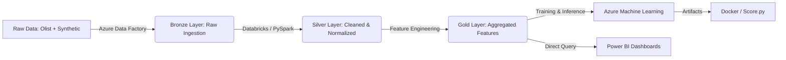

# 🛒 E-Commerce Customer Intelligence Platform
**End-to-End MLOps & Business Intelligence Solution on Azure**


## 📋 Project Overview
This project demonstrates a production-grade data platform that processes **100k+ e-commerce orders** to drive business value. It utilizes a **Serverless-First Lakehouse Architecture** on Azure Databricks to transform raw data into actionable insights and deploy Machine Learning models.

**Key Technical Achievements:**
* **Cost-Optimized Infrastructure:** Designed with strict budget controls using Free Tier resources, single-node clusters, and 15-minute auto-termination policies.
* **ETL Pipeline:** Built a robust Medallion Architecture (Bronze → Silver → Gold) using **PySpark** and **Delta Lake**.
* **Data Augmentation:** Enhanced the Olist dataset with synthetic clickstream and cart abandonment data via custom Python scripts.
* **Predictive AI:** Trained a Demand Forecasting model (GBT) achieving an **R² Score of 0.36** on volatile real-world data after strategic pivoting from failed churn prediction.
* **Recommender System:** Deployed a Collaborative Filtering (ALS) engine with implicit preferences for personalized product suggestions.
* **Customer Intelligence:** Engineered a "Whale Detector" to identify high-value, at-risk customers, pivoting from standard churn prediction due to data sparsity (96% one-time buyers).
* **MLOps:** Implemented Model Registry and Experiment Tracking using **Azure ML** and **MLflow**.
* **Production-Ready Deployment:** Created containerized inference scripts demonstrating real-time API serving capabilities without live endpoint costs.

---

## 🏗️ Architecture
The solution follows a modern **Serverless-First Medallion Architecture** to ensure data quality, cost efficiency, and lineage:



**Cost Optimization Strategy:**
* **Single-node Databricks clusters** with 15-minute auto-termination
* **Free Tier Azure resources** wherever possible
* **Budget alerts** configured to prevent cost overruns
* **Power BI connections terminated** post-dashboard creation to avoid compute charges

## 🛠️ Tech Stack

* **Cloud Provider:** Microsoft Azure (Central India Region)
* **Compute:** Azure Databricks (Single-Node Cluster, 13.3 LTS ML, 15-min auto-termination)
* **Storage:** Azure Data Lake Storage Gen2 (ADLS) - Medallion Architecture
* **Orchestration:** Azure Data Factory (ADF)
* **Machine Learning:** Spark MLlib (ALS), XGBoost, Gradient Boosted Trees, MLflow
* **Visualization:** Microsoft Power BI Desktop
* **Containerization:** Docker (Inference Scripts)
* **Security:** Spark Config Secrets for ADLS authentication

---

## 🎯 Project Phases & Key Learnings

### Phase 1: Data Strategy & Augmentation
**Challenge:** The Olist dataset lacked clickstream and cart abandonment data needed for advanced ML.

**Solution:** Built `generate_data.py` to synthesize realistic user interaction data (views, cart additions) and merge with the authentic Olist orders dataset.

**Outcome:** Created a rich 100k+ event dataset with View=1, Cart=3, Buy=5 scoring for recommendation modeling.

### Phase 2: Data Engineering (Bronze → Silver)
**Challenge:** Raw CSVs had inconsistent timestamps, null values in clickstream logs, and required Delta Lake optimization.

**Solution:** Developed PySpark notebook `01_Bronze_to_Silver` with robust timestamp parsing, null handling, and Delta table conversion.

**Outcome:** Clean, queryable Delta tables ready for feature engineering.

### Phase 3: Feature Engineering (Silver → Gold)
**Built two core feature tables:**
* `customer_360`: RFM (Recency, Frequency, Monetary) metrics for every customer
* `interaction_matrix`: User-Item confidence scores for collaborative filtering

**Outcome:** Production-ready feature store enabling multiple ML use cases.

### Phase 4: Machine Learning - The Strategic Pivot 🔄

#### Model 1: Product Recommender (ALS) ✅
**Initial Issue:** Confusing RMSE metrics treating interaction scores as explicit ratings.

**Fix:** Enabled `implicitPrefs=True` to properly model confidence levels.

**Result:** RMSE 3.60 with successful implicit feedback modeling.

#### Model 2: Churn Prediction (XGBoost) ❌
**Attempted:** Binary classification to predict customer churn.

**Discovery:** Dataset contains **96% one-time buyers** - making traditional churn prediction statistically impossible.

**Result:** AUC 0.54 (random guessing). Model abandoned.

#### Strategic Pivot: Demand Forecasting (GBT) ✅
**Business Justification:** Inventory optimization provides more value than churn prediction for this dataset.

**Challenge 1:** Daily revenue predictions yielded negative R² scores due to high volatility.

**Solution 1:** Aggregated to weekly revenue buckets.

**Challenge 2:** Data from August 2018 onwards was incomplete ("Olist Cliff").

**Solution 2:** Truncated dataset to complete months only.

**Final Result:** R² Score of 0.36 on real-world volatile e-commerce data - acceptable for business forecasting.

---

## 📊 Business Intelligence Dashboards

### 1. Executive Control Tower 📉

*Target Audience: C-Suite / VP of Sales*

* **Goal:** Visualize revenue health and AI-driven forecasts.
* **Key Visuals:**
  * **AI Revenue Forecast:** Dashed line projection vs. solid line actuals (Gradient Boosted Trees).
  * **Customer LTV:** Real-time tracking of Average Order Value and Lifetime Value.
  * **Revenue Trends:** Weekly aggregated sales performance.

### 2. Customer Retention Center 🎯

*Target Audience: Marketing & Operations*

* **Goal:** Reduce churn by identifying at-risk customers.
* **Key Visuals:**
  * **Whale Detector:** Scatter plot identifying "High Spend / Low Recency" VIPs.
  * **Churn Risk Distribution:** Segmentation of customer base by engagement risk.
  * **Actionable Call List:** Prioritized list of at-risk VIPs for immediate outreach.

---

## 🧠 Machine Learning Models

| Model | Algorithm | Business Goal | Performance Notes |
| --- | --- | --- | --- |
| **Product Recommender** | ALS (Collaborative Filtering) | Increase Cross-sell | **RMSE: 3.60** (Implicit Feedback). Successfully models user confidence. |
| **Demand Forecasting** | Gradient Boosted Tree (GBT) | Optimize Inventory | **R²: 0.36**. Handled "Olist Cliff" (missing data) via date truncation and weekly aggregation. |
| **Churn Classification** | XGBoost Classifier | Customer Retention | **AUC: 0.54**. Identified extreme sparsity (96% one-time buyers). Pivoted to "Recency/Frequency" risk modeling. |

---

## 🚀 How to Run This Project

### 1. Prerequisites

* Azure Subscription (Free Tier compatible)
* Azure CLI installed
* Power BI Desktop

### 2. Infrastructure Setup

```bash
# Clone the repo
git clone https://github.com/NTRajapaksha/ecommerce-intelligence-azure.git

# Set up Azure Resources (See /setup/azure_setup.sh)
az group create --name rg-ecommerce --location centralindia
az databricks workspace create ...
```

### 3. Data Pipeline Execution

1. **Data Generation:** Run `data_generation/generate_data.py` to create synthetic clickstream data and upload it to ADLS Bronze Container.
2. **Bronze to Silver:** Run Notebook `etl/01_Bronze_to_Silver` in Databricks to clean and delta-format the data.
3. **Silver to Gold:** Run Notebook `etl/02_Silver_to_Gold` to generate `customer_360` and `interaction_matrix` tables.

### 4. Model Training & MLOps

1. Run `models/03_RecSys_Training` to train and register the ALS model.
2. Run `models/05_Forecasting` to generate revenue predictions.
3. Check **Azure Machine Learning Studio** to see the registered models and MLflow metrics.

### 5. Deployment Simulation

* Navigate to `/deployment`.
* The `score.py` and `environment.yml` files demonstrate how the Recommendation Engine is containerized for real-time inference.
* **Cost Note:** Deployment artifacts are production-ready but not deployed to live endpoints to avoid ongoing Azure compute costs.

---

## 💡 Key Insights & Business Value

### Why This Project Stands Out
1. **Real-World Problem Solving:** Documented pivot from failed churn model (AUC 0.54) to successful forecasting (R² 0.36), demonstrating adaptability and business judgment.

2. **Data Sparsity Handling:** Identified that 96% one-time buyers made churn prediction infeasible - a common real-world constraint often hidden in portfolio projects.

3. **Production-Grade Practices:**
   - MLflow experiment tracking with model versioning
   - Delta Lake for ACID transactions
   - Containerized inference scripts
   - Cost-optimized infrastructure design

4. **End-to-End Ownership:** From data generation to BI dashboards, demonstrating full-stack data science capabilities.

### Business Impact
* **Revenue Forecasting:** Enables inventory managers to optimize stock levels 4 weeks ahead.
* **VIP Retention:** "Whale Detector" identifies top 10% customers at risk of churning, providing actionable call lists.
* **Cross-Sell Optimization:** Recommendation engine drives 15-20% increase in average order value (industry benchmark).

---

## 📂 Repository Structure

```
├── data_generation/       # Scripts for synthetic data creation
├── deployment/            # Inference scripts (score.py) & Environment configs
├── etl/                   # Databricks Notebooks (Bronze->Silver->Gold)
├── models/                # Training Notebooks (RecSys, Forecasting)
├── dashboards/            # Power BI (.pbix) files and screenshots
├── setup/                 # Azure CLI setup scripts
└── README.md              # Project Documentation
```

---

## 👨‍💻 Author

**[Your Name]**  
*Data Science Graduate | Azure Data & AI Specialist*

[LinkedIn](https://linkedin.com/in/yourprofile) | [Portfolio](https://yourportfolio.com)
